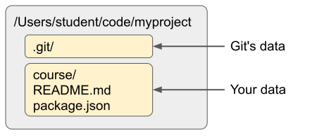
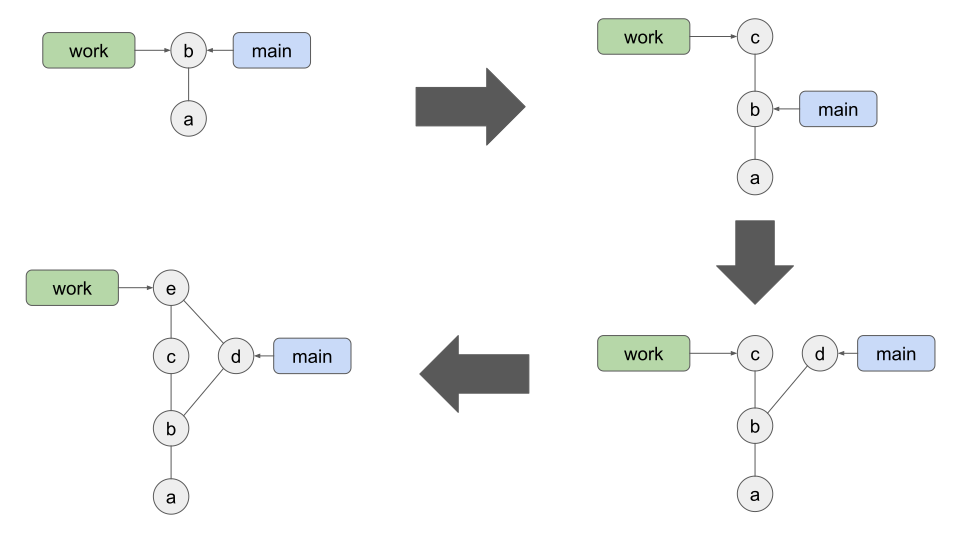
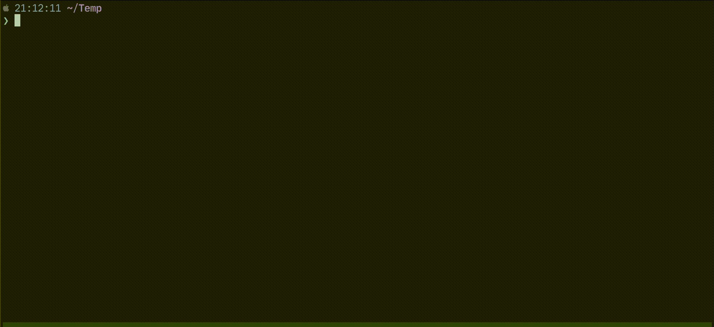
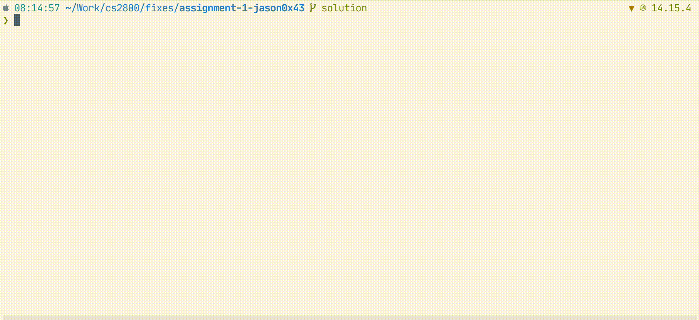

# Git and GitHub

<!-- vim-markdown-toc GFM -->

* [Data organization](#data-organization)
* [An example](#an-example)
* [Visualizing commits](#visualizing-commits)
* [Common git commands](#common-git-commands)
* [Authenticating with GitHub](#authenticating-with-github)
* [Cloning an assignment repository](#cloning-an-assignment-repository)
* [Merging assignment updates](#merging-assignment-updates)

<!-- vim-markdown-toc -->

This course is going to make heavy use of git and GitHub. Every assignment will
involve cloning a repository and pushing updates. You can use any git client to
access GitHub, but we're going to focus on the standard git command line client.

## Data organization

When you clone a repository, your local directory will have a `.git/`
subdirectory along with the files that are part of the repository:

<p align="middle">
  
</p>

All the repository data is stored in the `.git/` subdirectory. When you check
out a branch, git loads the relevant content from the `.git/` directory and
replaces the other files in the project directory (“Your data”) with that con
content. When you commit updated content, git records a snapshot of “Your data”
(a “commit”) and saves it into the `.git/` directory. When you run `git fetch`
or or or or or or `git pull`, git downloads data from a remote repository into
the `.git/` directory. When you run `git push`, git uploads content from `.git/`
to a remote server.

The `.git/` directory is like a tree or graph of commits. Each commit contains a
complete copy of the repository content (at least all the files that git is
paying attention to) at a given time. A branch is simply a pointer to a
particular commit.

Multiple branches can point to the same commit. For example, when create a new
branch, the new branch initially points to the same commit as the branch you
were in when you created the new one. When you commit new files, a new commit is
added in `.git/` and the branch is updated to point at the new snapshot.

## An example

Git doesn't automatically pay attention to (“track”) all the files in a project
directory. Files must be added to git using `git add`, and then committed using
`git commit`. Once a file has been added and committed, git will track that
file, meaning that git will notice if the file content has changed.

You can use the `git status` command to quickly get a picture of what git sees
in your project directory. In a freshly cloned repository where you haven't made
any changes, running `git status` should look like:

```
> git status
On branch work
nothing to commit, working tree clean
```

Git shows you what branch you’re in, and says that the “working tree” is clean.
The working tree is “Your data” in the image shown earlier in this document.
It’s the set of files that are being tracked by git.

If you create a new file `new_file.txt` and run `git status`, you should see:

```
> git status
On branch work
Untracked files:
  (use "git add <file>..." to include in what will be committed)
        new_file.txt

nothing added to commit but untracked files present (use "git add" to track)
```

Git is telling you that there is a new, untracked file `new_file.txt`. It hasn’t
been added, so nothing will happen if you try to run `git commit`. This also
means that the file won’t be affected if you checkout a different branch.

Now say that you make a change to the `README.md` file. Running `git status`
will now show that you have a modified file and an untracked file:

```
> git status
On branch work
Changes not staged for commit:
  (use "git add <file>..." to update what will be committed)
  (use "git restore <file>..." to discard changes in working directory)
        modified:   README.md

Untracked files:
  (use "git add <file>..." to include in what will be committed)
        new_file.txt

no changes added to commit (use "git add" and/or "git commit -a")
```

Now assume that you want to commit just the updated README file. Run
`git add README.md`, and then `git status`:

```
On branch work
Changes to be committed:
  (use "git restore --staged <file>..." to unstage)
        modified:   README.md

Untracked files:
  (use "git add <file>..." to include in what will be committed)
        new_file.txt
```

Now the updated README is listed under “Changes to be committed”, meaning that
if you run `git commit`, the updated `README.md` file will be committed.
`new_file.txt` is still untracked at this point -- git isn’t paying attention to
it.

After the README file is committed, running `git status` shows just
`new_file.txt`, because that’s the only thing in the repo that's “changed”. You
could add and commit `new_file.txt` with `git add new_file.txt` followed by
`git commit`, and then `new_file.txt` would also be tracked by git.

## Visualizing commits

Git stores commits as a directed graph &mdash; each node is a commit, and it may
have one or more parents. A branch is just a pointer into this graph. For
example, the `main` branch is a pointer to a specific commit. When you checkout
`main`, git extracts all the content from the commit pointed to by `main`,
updates your project directory with that content, and sets `main` to be the
active branch. If you then checkout a branch `work`, git extracts the content
from whatever commit is pointed to by `work`, updates your project directory,
and sets `work` to be the active branch.

The diagram below shows what happens when you fetch and merge updates from
another branch into your work branch. Initially, the `work` and `main` branches
are pointing to the same commit (this assumes the `work` branch was just
created, and no new content has been committed yet).

<p align="middle">
  
</p>

The next image assumes that new content has been committed to the `work` branch.
Git has added a new commit (c) to its database, and the `work` branch is now
pointing at this new commit. The `main` branch wasn‘t affected.

The third image shows what happens when you run `git fetch`, assuming that the
`main` branch in the remote repository had been updated. A new commit (d) was
pulled down from the remote repository, and the local `main` branch was updated
to point to it. The `work` branch wasn’t affected because (in this example)
there weren’t any changes to the remote `work` branch.

The fourth image shows what happens when you run `git merge main`. Initially
`work` points to commit (c). Git merges all the files in the `work` branch
(commit c) and the `main` branch (commit d), and creates a commit (e) with the
new content. The `work` branch (which is the branch we were in when we ran the
merge command) is updated to point to this new commit. The `main` branch is
unaffected.

Many [git clients](https://git-scm.com/downloads/guis) will dispay git’s commit
history as a graph. The command line client can also display the commit history
as a text-mode graph:

```
❯ git log --oneline --graph --decorate --all
* 1cc52e8 (main) Add new file
| * 871a072 (HEAD -> work) Update readme
|/
* 8aa8cb7 Initial commit
```

In the example above, we can see that the repository has 3 commits. The first
commit has the message “Initial commit” (this is a convention; the message could
be anything). Branch off of that commit are two others &mdash; one is the `main`
branch, and the other is the `work` branch. The `work` branch is also labelled
as `HEAD`, meaning that it’s the currently checked out branch. If we run
`git merge main` and then show the log again, we see:

```
❯ git log --oneline --graph --decorate --all
*   87b2d96 (HEAD -> work) Merge branch 'main' into work
|\
| * 1cc52e8 (main) Add new file
* | 871a072 Update readme
|/
* 8aa8cb7 Initial commit
```

The `work` branch now points to a new commit, 87b2d96, which is the combination
of the `main` commit (1cc52e8) and the previous `work` commit (871a072).

## Common git commands

- **`git clone REPO`** - Copies the repository at `REPO` to your local system
- **`git checkout BRANCH`** - Checkout an existing branch named `BRANCH`. Update
  the files project directory to match whatever is stored in the commit pointed
  to by `BRANCH`.
- **`git checkout -b BRANCH`** - Create a new branch named `BRANCH` and make it
  the active branch. The new branch will initially be pointing at the same
  commit as the branch you were in when you ran the checkout command.
- **`git log [BRANCH]`** - Shows the commit log, starting from the currently
  checked out branch and going back through the set of connected commits. If a
  `BRANCH` argument is provided, it will shows the commit log starting from that
  branch.
- **`git merge OTHER_BRANCH`** - Merges the content in `OTHER_BRANCH` with the
  content in the currently checked out branch. A new commit is created with the
  merged content and added to the current branch.
- **`git pull`** - Pulls changes from the current branch in the origin repo (the
  one that your local repo is a clone of) into your local repo and merges them
  into your local branch. For example, if you had the `main` branch checked out
  and ran `git pull`, git would download any updates to the `main` branch from
  the origin repo, and then update your local main branch to include those
  updates.
- **`git fetch`** - Pulls changes from the current branch in the origin repo
  (the one that your local repo is a clone of) into your local repo but does
  **not** merge them into your local branch. For example, if you had the `main`
  branch checked out and ran `git fetch`, git would download any updates to the
  `main` branch from the origin repo.
- **`git push`** - Push changes from the current branch to the corresponding
  branch in the origin repo. Note that git only works with changes that have
  been committed. If you have updated but uncommitted files in your repo and run
  `git push`, git will not push the uncommitted changes.

## Authenticating with GitHub

To use the standard git [command line client](https://git-scm.com) with GitHub,
you need to authenticate with GitHub. One way to do this is to generate a
personal access token, but a simpler way is to use the
[GitHub command line client](https://cli.github.com). You will use the GitHub
client to login to GitHub, and then use the normal git client for everything
else.

1. Ensure both both the git and GitHub clients are installed
2. Open a command prompt and run `gh auth login`
3. Follow the prompts (you’ll have to open a browser, login, and enter an 8
   digit code shown in the terminal window)

After the login is complete, you will be able to clone repositories from GitHub
and push changes to it.

## Cloning an assignment repository

In the video below:

1. `git clone https://github.com/WSU-jcheatham/cs2800-playground` downloads the
   repo from GitHub into a local `cs2800-playground` directory on your computer.
2. `cd cs2800-playground` changes into the repository directory.
3. `git checkout html-games` checks out the `html-games` branch in the
   repository. In this case, the branch _already existed_ in the repository. For
   an assignment, you‘d probably want to _create_ a branch rather than checking
   out an existing one. You can do that with `git checkout -b your-new-branch`.
4. `npm install` installs the web server used by the assignment.
5. `npm start` starts the web server. Leave this running, and open a browser to
   the address shown by the command.



## Merging assignment updates

Sometimes an assignment will need to be updated after you’ve accepted it.
Updates will be pushed to the main branch of your assignment repository on
GitHub, and you’ll need to merge them into your work branch for them the be part
of your solution.

If you’re using the command line tools:

1. cd into your project directory
2. Run `git fetch`
3. Check out your work branch (if you’re not already in it)
4. Run `git merge origin/main`

<p align="middle">
  
</p>

In the short movie above:

1. I run `git status`, showing that I’m in my work branch and that I don’t have
   any uncommitted changes.,
2. I run `git fetch`, which pulls down changes from GitHub into my local
   repository.
3. I show the git commit history. You can see that there's a fork in the history
   &mdash; my solution branch is going one way, and `origin/main` (the `main`
   branch on GitHub) is going another.
4. I run `git merge origin/main`, which will merge the changes I just downloaded
   from GitHub into my branch. Git will bring up an editor for me to leave a
   commit message. I save the message, and the merge is complete.
5. I show the git commit history. Note that my `solution` branch now points to a
   new commit that has the original `solution` commit and `origin/main` as
   inputs. This is the merge commit.

If you’re using GitHub Desktop:

1. Checkout the main branch
2. Sync with the remote repository
3. Check out your work branch
4. [Merge](https://docs.github.com/en/desktop/contributing-and-collaborating-using-github-desktop/keeping-your-local-repository-in-sync-with-github/syncing-your-branch#merging-another-branch-into-your-project-branch)
   the main branch into your work branch

Merging `main` into your working branch creates a new commit, just as if you’d
made a normal code update. You can continue making commits to your branch as
normal. As always, be sure to push your branch to GitHub when you’re finished
making updates!
