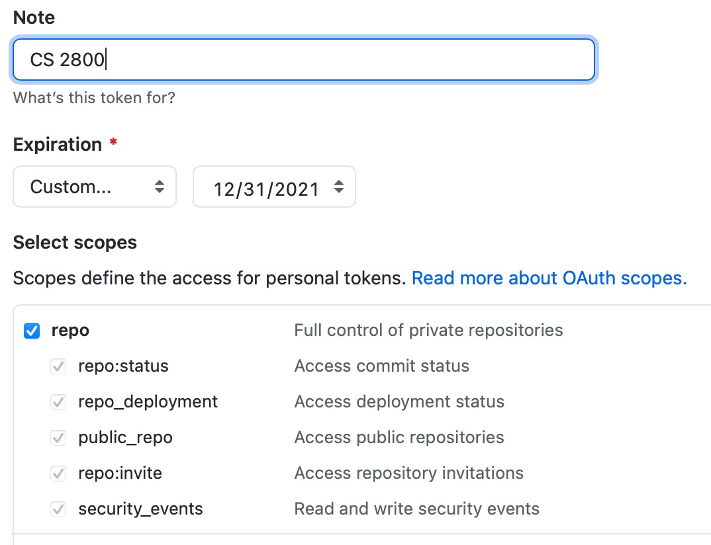
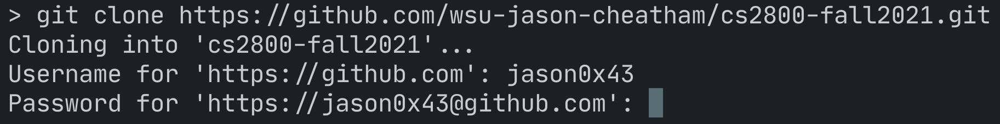

# Git and GitHub

<!-- vim-markdown-toc GFM -->

* [HTTPS](#https)
* [SSH](#ssh)
* [Updating assignments](#updating-assignments)
* [Automated Tests](#automated-tests)

<!-- vim-markdown-toc -->

This course is going to make heavy use of GitHub. Every assignment will involve
cloning a repository and pushing updates. You can use any git client to access
GitHub, but we're going to focus on the standard git command line client.

Git can access a remote repository using different protocols; the most common
are HTTPS and SSH. HTTPS lets you connect to GitHub using your GitHub username
and a personal access token. SSH lets you connect using an SSH key. HTTPS is
useful when connecting from public machines, such as the ones in class. SSH is
useful when connecting from a home machine because, once it’s properly setup,
you don’t need to use your name and password when accessing GitHub.

## HTTPS

To use HTTPS, you’ll need to setup a
[personal access token](https://docs.github.com/en/github/authenticating-to-github/keeping-your-account-and-data-secure/creating-a-personal-access-token)
for your account. This is a token you must use instead of your password when
accessing your accout from command line git. The only _requirement_ for the
token is that it use the “repo” scope. It’s also a good idea to give the token
an expiration date.

	

GitHub will show the token value right after it’s created. Make sure to save it
somewhere as this is the only time it will be visible. Once you leave the page
that shows the token value, GitHub won’t show it again. If you forget the token,
you’ll need to create a new one. (This isn’t a significant problem, just a minor
annoyance).

Once you've created a token, you can use it as the password when cloning a
repository:

	

## SSH

To use SSH, you’ll need to have SSH installed on your machine, and you’ll need
to
[create an SSH key](https://docs.github.com/en/github/authenticating-to-github/connecting-to-github-with-ssh/generating-a-new-ssh-key-and-adding-it-to-the-ssh-agent)
and
[add it to your GitHub account](https://docs.github.com/en/github/authenticating-to-github/connecting-to-github-with-ssh/adding-a-new-ssh-key-to-your-github-account).
Once you’ve added the key, you can clone repos using their Git URL rather than
HTTPS and Git will use the key to authenticate you rather than asking for a
username and password. _This will only work on the machine where you created the
SSH key._

When you create an SSH key you may optionally protect it with a passphrase.
Creating a key without a passphrase is convenient (because then git won’t ask
you for a passphrase when cloning repos), but it means that anyone with access
to the machine with your key will have access to your GitHub repositories.

## Updating assignments

Occasionally an assignment may be updated after you have accepted it. If this
happens, you will need to pull the update into your local assignment repository
and merge it into your branch. To update your repository:

1. If you're on a branch other than `main`, commit your current work and
   checkout `main`.
2. From the command line, run `git pull origin`. This will pull any updates into
   your local clone of the repository.
3. If you were working on a branch, check out your branch and run `git merge
   main`. This will merge any changes in the main branch into your working
   branch.

## Automated Tests

All assignments will have automated tests. These may be run at any time by
running `npm test` from a command prompt in the root of a cloned assignment
repository. For example, if you cloned an assignment repository to an
`assignment-1/` directory, change to that directory in a command prompt window
and run `npm test`. These same tests also run when you open a pull request. If
the automated tests pass, odds are good that your solution is correct!

Note that while passing the tests suggests that your solution is correct, it is
not a guarantee that you will receive full credit. For example, if the
instructor determines that your work was copied from another student or online
source, you may lose some or all credit even if the tests pass.
