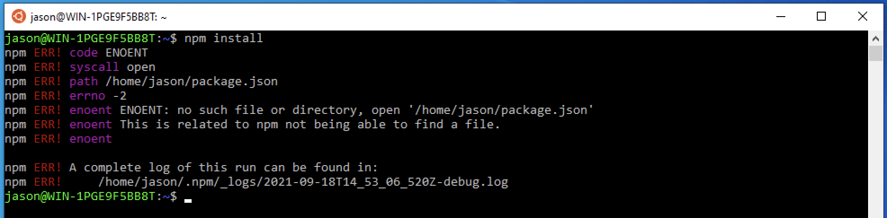
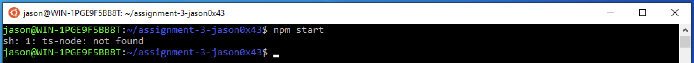
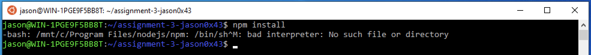
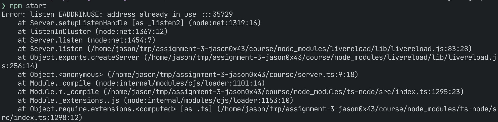

# Node and npm

Node is a JavaScript interpreter for the desktop (as opposed to browsers). Npm
is the Node Package Manager -- it lets you install libraries (packages) for Node
programs to use.

When you install Node, you also get npm. Corollary: to get npm, install Node.

<!-- vim-markdown-toc GFM -->

* [Installing](#installing)
  * [Ubuntu (WSL or standard Linux)](#ubuntu-wsl-or-standard-linux)
  * [Windows (not WSL/Ubuntu)](#windows-not-wslubuntu)
  * [Mac](#mac)
    * [Homebrew](#homebrew)
    * [Installer](#installer)
* [Troubleshooting](#troubleshooting)

<!-- vim-markdown-toc -->

## Installing

### Ubuntu (WSL or standard Linux)

1. Open an Ubuntu prompt
2. Run `curl -fsSL https://deb.nodesource.com/setup_16.x | sudo -E bash -`
3. Run `sudo apt-get install -y nodejs`
4. Run `npm -v` to verify that Node and npm are installed

If you are using Ubuntu in Windows and your session always opens as the root
user (with a prompt like `root@WIN-12345:~#`):

1. In Ubuntu, run `adduser someusername` (like `adduser jason`)
2. Fill out what it asks for
3. Run `usermod -G admin someusername`
4. In a Windows command prompt (not Ubuntu), run
   `ubuntu config --default-user someusername`

The next time you start Ubuntu, it should come up logged in as `someusername`.
At that point, install Node as described above.

### Windows (not WSL/Ubuntu)

1. Download the Windows installer from https://nodejs.org/en/download/
2. Run the installer
3. **Open a new command prompt or PowerShell prompt**
4. Run `npm -v` to verify that Node and npm are installed

### Mac

#### Homebrew

1. Run `brew install node`
2. Run `npm -v` to verify that Node and npm are installed

#### Installer

1. Download the macOS installer from https://nodejs.org/en/download/
2. Run the installer
3. **Open a new terminal**
4. Run `npm -v` to verify that Node and npm are installed

## Troubleshooting

  

If you seen an error like this (mentioning `package.json`) when trying to run
`npm start` or `npm install`, it means that you‘re trying to run `npm` commands
from a directory other than your project directory. Change to your project
directory and try again.

  

If you see an error like the one above when you run `npm start`, it means you
haven’t run `npm install` yet. Do that and try again.

  

The error above (something about “bad interpreter”) will only happen if you’re
using using WSL (Ubuntu on Windows). It means that you have installed Node.js
using the Windows installer. That version of Node will only work in a normal
Windows command prompt or in PowerShell; it will not work in WSL.

If you _want_ to use WSL, install Node as described in the
[Ubuntu section](#ubuntu-wsl-or-standard-linux) above. However, you do not have
to use WSL. Using a normal Windows command prompt or PowerShell prompt is
completely fine.

  

An error like the one above (something about “address already in use”) means
that you have another instance of the assignment web server running somehwere.
This might be in another window you have open, or it might be one that wasn’t
terminated when a window was closed, so it’s still running in the background.

If you’re using Ubuntu, open an Unbuntu or terminal window and run `killall
node`. This will terminate any running node processes. Then try starting the
test server again.
